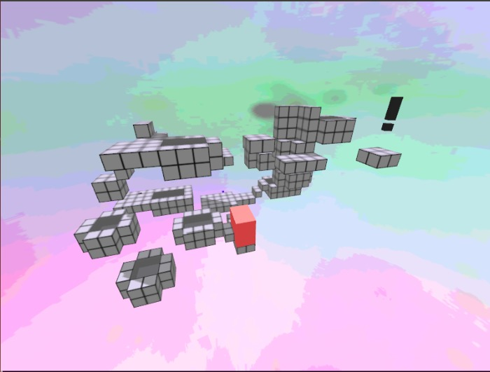
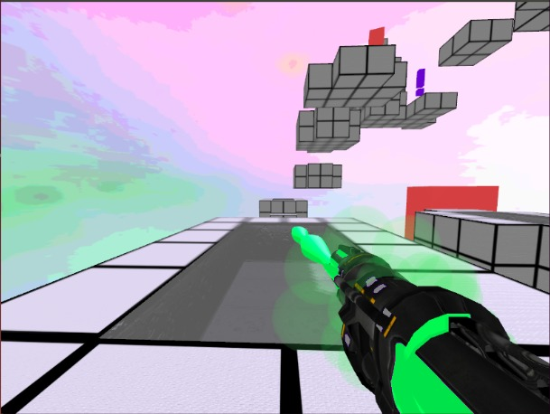
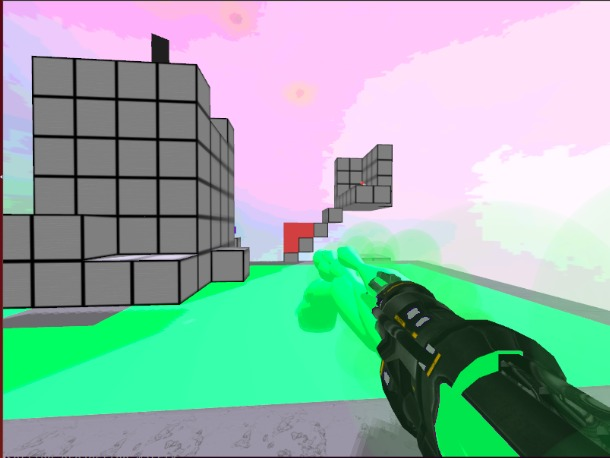
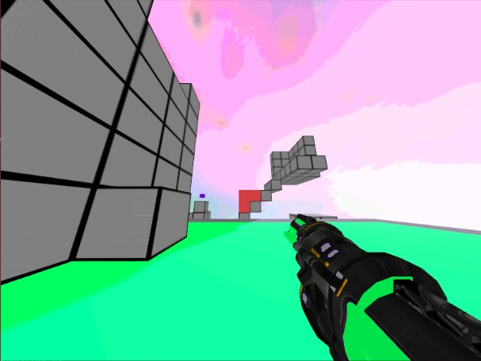

Flood Fill
==========

Watch a full playthrough on YouTube:

[](https://youtu.be/fUIOg2MwD7E)

Flood Fill is a first-person puzzle solving game. The player is equipped with a paint gun which can fill a level with a specific colored paint. There are three colors which have different abilities when stepped on: Green is speed; Blue is high-jump; Red is speed and high-jump combine. Having two of the colors equipped at a time, the player must attempt to solve the puzzle and get to the finish.









User Guide
----------

W = Move Forward
S = Move Backward
A = Strafe left
D = Strafe right
Q = Change Colors
E = Toggle Switches
Space = Jump
Right Click = Shoot Paint/Skip Opening Scenes
Left Click = Delete 3x3 Grid of paint

Technologies
------------

* First person camera
* Three levels with puzzles
* Fluid heightmap animation
* 3D uniform spatial subdivision for collision detection
* Shadow maps
* View frustum culling 
* Voxel simplification algorithm
* Bump mapping
* Particle System

Authors
-------
* Daniel Johnson
* Matheus de Sousa Faria
* Corbin Gruber
* Gabriel Hernandez

## Installation

Install dependencies freetype and sfml.

Clone the repository, then cd into its directory.

```
    mkdir build
    cd build
    cmake ..
    make
    ./main
```

References
----------
* http://madebyevan.com/webgl-water/
* http://www.sfml-dev.org/tutorials/2.1/audio-sounds.php

